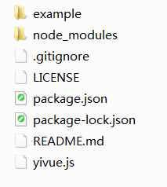
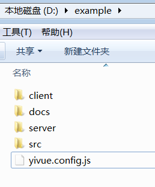
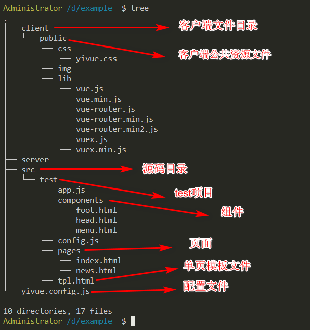
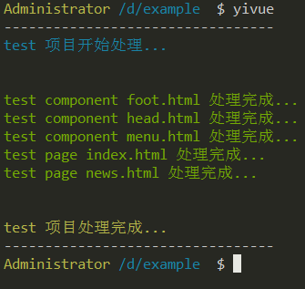
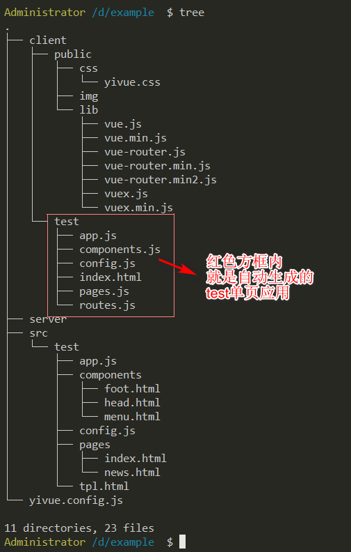
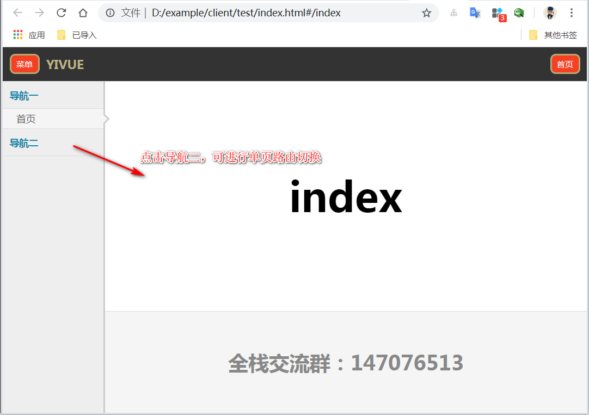
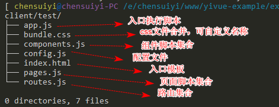

## YIVUE

    用简单易懂的方式，开发基于VUE的单页应用。

| 名称       | 说明                                                 |
| ---------- | ---------------------------------------------------- |
| 项目       | yivue                                                |
| 用途       | 使用简单易懂的方式开发 VUE 单页应用的构建处理工具。  |
| 版本       | 3.2.6                                                |
| 更新时间   | 2019 年 05 月 19 日                                  |
| 作者       | 陈随易                                               |
| 邮箱       | bimostyle@qq.com                                     |
| 知乎       | [知乎陈随易](https://www.zhihu.com/people/chensuiyi) |
| 全栈交流群 | 147076513                                            |

## 使用方式

### 全局安装`yiuve`到本地

    npm install -g yivue

#### 结构如下



### 复制本模块下的`example`示例项目到任意自己喜欢的目录下。

    这里，我放到了D盘根目录下



### 项目组织结构一览



src 目录下的每个直接子目录，都是一个单独的单页项目。如果要同时开发后台单页，官网单页，用户后台单页等等多个单页项目，直接复制`src`目录下的`test`目录，并修改文件名，配置到`yivue.config.js`文件中即可。

### 直接在本目录下执行`yivue`命令。

    yivue

#### 结果如下



### 查看当前的目录结构



### 用浏览器打`开index.html`文件



### 生成单页项目结构



    没错！！！就是这么简简单单的结构，没有任何其他多余的东西！！！

## 源代码编写

### 单页模板文件`tpl.html`

```html
<!DOCTYPE html>
<html>
    <head>
        <title>yivue demo</title>
        <meta charset="utf-8" />
        <meta name="viewport" content="width=device-width,initial-scale=1.0,minimum-scale=1.0,maximum-scale=1.0,user-scalable=no" />
        <link rel="stylesheet" type="text/css" href="../public/css/yivue.css" />
    </head>

    <body>
        <div class="YiVue" id="YiVue">
            <router-view name="head"></router-view>
            <router-view name="menu"></router-view>
            <router-view name="body"></router-view>
            <router-view name="foot"></router-view>
        </div>
    </body>

    <!--[组件文件]-->
    <!--[:yivue_components]-->
    <!--[组件文件]-->

    <!--[页面文件]-->
    <!--[:yivue_pages]-->
    <!--[页面文件]-->

    <!-- vue库 -->
    <script src="../public/lib/vue.min.js"></script>
    <!-- vue-router 路由库 -->
    <script src="../public/lib/vue-router.min.js"></script>
    <!-- 配置文件 -->
    <script src="config.js"></script>
    <!-- 组件资源 -->
    <script src="components.js"></script>
    <!-- 页面资源 -->
    <script src="pages.js"></script>
    <!-- 路由资源 -->
    <script src="routes.js"></script>
    <!-- 入口文件 -->
    <script src="app.js"></script>
</html>
```

    非常正常的一个普通`html`页面，如果看不懂，请先研究`vue.js`，学会它的基本概念和使用方式。

### 这里需要注意的是

-   `<!--[:xxx]-->`这种类型字符不是注释！！！这是基于注释的特殊占位符语法！！！
-   `<!--[:components]-->`将会被组件模板集合替换掉。
-   `<!--[:pages]-->`将会被页面模板替换掉。

### 组件模板和页面模板长什么样呢？

    长这样，这是生成之后的模板。

```html
<!--[页面文件]-->
<script type="text/html" id="page-index">
    <div class="body" id="body">
    		index
    	</div>
</script>
<script type="text/html" id="page-news">
    <div class="body" id="body">
    		news
    	</div>
</script>

<!--[页面文件]-->
<!--[组件文件]-->
<script type="text/html" id="component-foot">
    <div class="foot">
    		<div>全栈交流群：147076513</div>
    	</div>
</script>
<script type="text/html" id="component-head">
    <div class="head">
    		<div class="left">
    			<div class="menu-icon left-menu">菜单</div>
    		</div>
    		<div class="logo">YIVUE</div>
    		<div class="right">
    			<div class="menu-icon right-menu">首页</div>
    		</div>
    	</div>
</script>
<script type="text/html" id="component-menu">
    <div class="menu">
    		<div class="accordion">
    			<div class="ul" v-for="ul in lists">
    				<div class="title" v-on:click="Toggle(ul)">{{ul.title}}</div>
    				<div class="ull" v-show="ul.isopen">
    					<div class="li" v-bind:class="{active:li.active}" v-for="li in ul.ull" v-on:click="GoHref(li)">
    						{{li.value}}</div>
    				</div>
    			</div>
    		</div>
    	</div>
</script>

<!--[组件文件]-->
```

    单页模板文件中的占位符只有 <!--[:components]--> 和 <!--[:pages]--> 两种！！！

### 入口文件`app.js`

```javascript
// 开始实例化VUE
var vm = new Vue({
    data: {
        // 全局共享数据
        globalData: {}
    },
    router: new VueRouter({
        routes: yivue.routes
    })
}).$mount("#YiVue");
```

    非常朴实的一个vue实例化。

### 配置文件`config.js`

```javascript
// 初始化 yivue 全局变量
var yivue = {};

// 初始化组件集
yivue.components = {};

// 初始化页面集
yivue.pages = {};

// 初始化路由集
yivue.routes = [];

// 重定向默认路由
yivue.routes.push({
    path: "/",
    redirect: "/index"
});
```

    所有的组件、页面、路由等，都挂在yivue全局变量下，所以，这个文件要放在脚本区域靠前的位置引入。

### 组件文件`component.html`

```html
<template>
    <div class="foot">
        <div>全栈交流群：147076513</div>
    </div>
</template>

<script type="text/javascript" yv-type="text/component">
    var component = {
        data: function() {
            return {};
        },
        template: document.getElementById("^-^").innerHTML
    };
</script>
```

-   `<template>`标签包裹普通的 html 页面文件。
-   `script`必须写上`yv-type="text/component"`自定义类型，不然`yivue`不识别。
-   脚本内的内容，如上所示，非常朴素的`vue`语法，不懂请去看 vue。
-   `^-^`是特殊的占位符，任何位置的`^-^`都会被替换成当前的文件名(不包括扩展名！！！)

### 页面文件`page.html`

```html
<!-- 模板 -->
<template>
    <div class="body" id="body">
        index
    </div>
</template>

<!-- 页面 -->
<script type="text/javascript" yv-type="text/page">
    var page = {
        data: function() {
            return {};
        },
        template: document.getElementById("^-^").innerHTML
    };
</script>

<!-- 路由 -->
<script type="text/javascript" yv-type="text/route">
    var route = {
        path: "/^-^",
        name: "^-^",
        components: {
            head: yivue.components["component-head"],
            menu: yivue.components["component-menu"],
            foot: yivue.components["component-foot"],
            body: yivue.pages["page-^-^"]
        }
    };
</script>
```

    跟组件差不多，多了一个路由脚本，看不懂？请去看vue文档。

## 好了，没了。

    没有打包，没有构建，没有压缩，没有预处理，没有xxx!!!

## 嗯，就是这么朴实的一个猪都能使用的`vue`单页多项目生成工具`yivue`。
